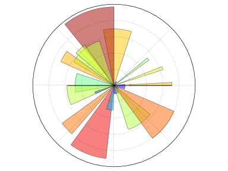
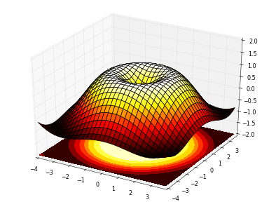
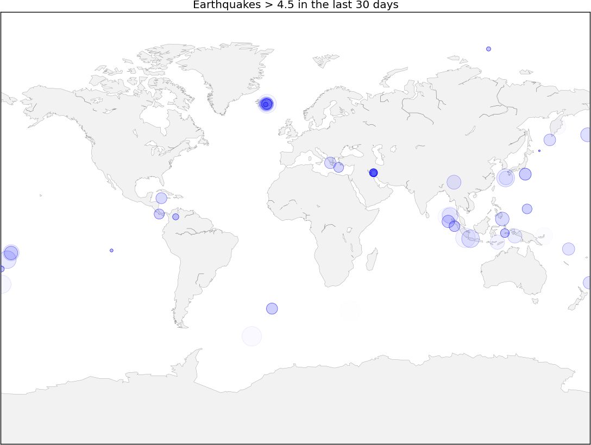

###################################################
# Curso de ploteo con python para ciencias economicas
###################################################

Graficar lineas

Hacer un scatter plot x vs y

Hacer un grafico de barra con rectangulos

Dibujar las lineas de contorno y llenarlos

Mostrar una imagen en los ejes

Dibujar un campo vectorial con flechas

Hacer un grafico de torta de un array

Hacer varios graficos en uno

Graficar lo que sea con ejes polares

Graficar datos en 2D o 3D

Dibujar cualquier clase de texto (inclusive Latex!)

Hacer graficos con datos geo-referenciados

